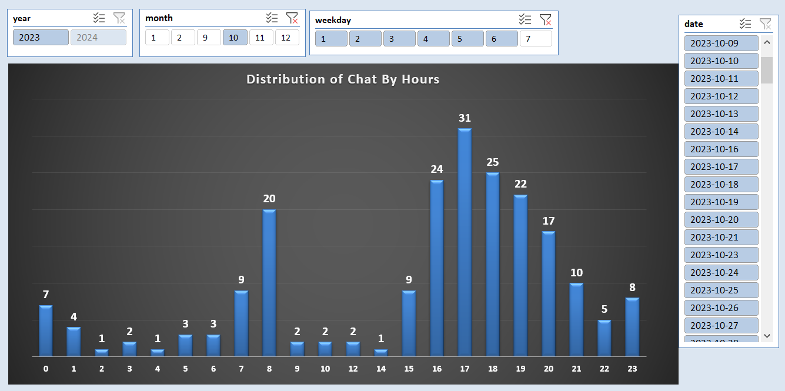

# Chatbot Selenium Project

## Problem:
In our current company, we are experimenting with a free chatbot to enhance customer interactions. 
However, due to the lack of APIs, we face challenges in extracting data to evaluate its performance 
and identify improvement opportunities, particularly for unanswered chats.

## My Solution:

### Web Scraping:
I developed a Selenium robot to:
- Log into the chatbot website.
- Apply necessary filters.
- Utilize BeautifulSoup to extract data from tables.

### Data Cleaning and Transformation:
- Created a pandas DataFrame to organize the raw data.
- Cleaned and formatted the dataset, ensuring accuracy and consistency.

### Data Visualization:
- Developed insightful visualizations to uncover trends and patterns in unanswered chats.
- This facilitated the identification of:
  - Peak times for unanswered chats.

### Interactive Dashboard:
- Designed an interactive Excel dashboard for stakeholders and management.
- Incorporated filters for different timeframes to dynamically analyze chat data.

## Impact:
- **Data-Driven Decision Making:** This project offers valuable insights into our chatbot's performance, empowering us to make 
informed decisions regarding its optimization.
